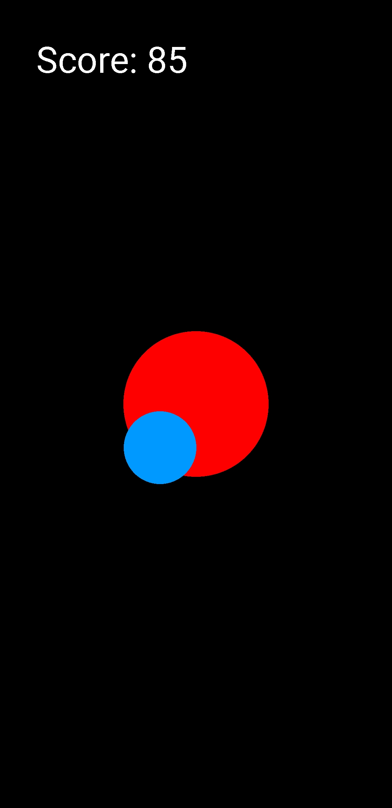
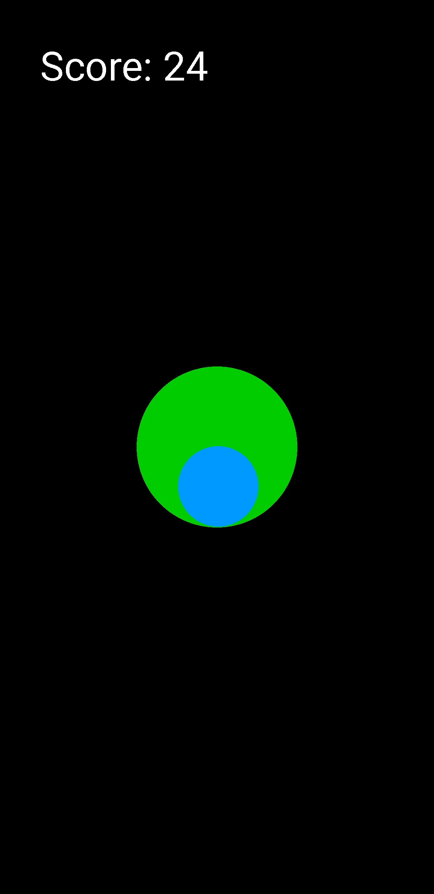

# Ball
Simple Android game written in Java that utilizes accelerometer to navigate 2D ball on the screen.

The goal of the game is to hold the ball within the circle in the middle of the screen as long as possible. When you are in this circle it changes it's color to green and you earn points to yout score. But beware! When your ball touches the border of the screen you will lose your pionts 10 times faster than you've earned them!

Sounds simple? Well, it is not! Every two seconds ball starts to move in random direction. Also the higher your score is, the farther it goes!

Ball in the middle means player is earning points.
